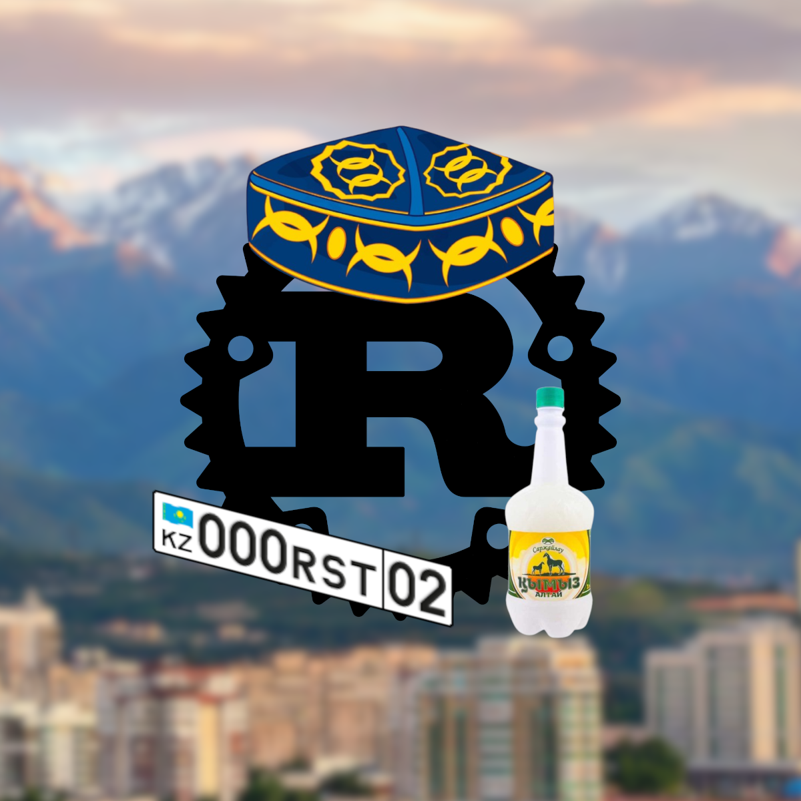

# rouille



Why you _cannot_ write Rust programs in your native language? Do you shy of it? Would you like to try something different, in an exotic and lovely sounding language? Would you want to bring some Kazakh hospitality to your programs?

**тот** (Kazakh for _Rust_) is here to save your day, as it allows you to
write Rust programs in Kazakh, using Kazakh keywords, Kazakh function names,
and Kazakh idioms.

I hope that this language will be selected to write all future government systems in Kazakhstan to reach digital sovereignty.

If you're aga from the Kazakhstan, find my email in the profile and reach for cooperation (wink, wink).

Here's an example of what would would be if programming languages was invented by Kazakh people. Right now in Тот:

### trait and impl (aka convention et réalisation)

```rust
tot::тот! {
    сыртқы жәшік tot;

    пайдалану std::collections::ХэшМап ретінде Сөзд;

    қасиет КілттікМән {
        фн жазу(&өзім, кілт: Жол, құндылық: Жол);
        фн алу(&өзім, кілт: Жол) -> Нәтиже<Опция<&Жол>, Жол>;
    }

    статик өзг СӨЗДІК: Опция<Сөзд<Жол, Жол>> = Жоқ;

    құрыл Concrète;

    асыру КілттікМән үшін Concrète {
        фн жазу(&өзім, кілт: Жол, құндылық: Жол) {
            беру сөзд = қауіпсіземес {
                СӨЗДІК.алу_немесе_енгізу(Әдепкі::әдепкі)
            };
            сөзд.кірістіру(кілт, құндылық);
        }
        фн алу(&өзім, кілт: Жол) -> Нәтиже<Опция<&Жол>, Жол> {
            егер беру Кейбір(сөзд) = қауіпсіземес { СӨЗДІК.сіл_ретінде() } {
                Жарайды(сөзд.алу(&кілт))
            } басқа {
                Қт("сөздікті алып келу".ішіне())
            }
        }
    }
}
```

### Other examples

See the [examples](./examples/src/main.rs) to get a sense of the whole
syntax.

## Contributions

First of all, _рахмет_ for considering participating to this joke, you will have opportunity sell this to Kazakh government later! Feel free to throw in a few identifiers
here and there, and open a pull-request against the `негізгі` (Kazakh for
`main`) branch.

Be civil, don't use swear words. We should show hospitality to the visitors of this repo.

## Other languages

- Dutch: [roest](https://github.com/jeroenhd/roest)
- German: [rost](https://github.com/michidk/rost)
- Polish: [rdza](https://github.com/phaux/rdza)
- Italian: [ruggine](https://github.com/DamianX/ruggine)
- Russian: [Ржавый](https://github.com/Sanceilaks/rzhavchina)
- Esperanto: [rustteksto](https://github.com/dscottboggs/rustteksto)
- Toki Pona: [jaki kiwen](https://github.com/jgcodes2020/jaki-kiwen)
- Hindi: [zung](https://github.com/rishit-khandelwal/zung)
- Hungarian: [rozsda](https://github.com/jozsefsallai/rozsda)
- Chinese: [xiu (锈)](https://github.com/lucifer1004/xiu)
- Spanish: [rustico](https://github.com/UltiRequiem/rustico)
- Korean: [Nok (녹)](https://github.com/Alfex4936/nok)
- Finnish: [ruoste](https://github.com/vkoskiv/ruoste)
- Arabic: [sada](https://github.com/LAYGATOR/sada)
- Turkish: [pas](https://github.com/ekimb/pas)
- Vietnamese: [gỉ](https://github.com/Huy-Ngo/gir)
- Japanese: [sabi (錆)](https://github.com/yuk1ty/sabi)
- Danish: [rust?](https://github.com/LunaTheFoxgirl/rust-dk)
- Marathi: [gan̄ja](https://github.com/pranavgade20/ganja)
- Romanian: [rugină](https://github.com/aionescu/rugina)
- Czech: [rez](https://github.com/radekvit/rez)
- Ukrainian: [irzha](https://github.com/brokeyourbike/irzha)
- Bulgarian: [ryzhda](https://github.com/gavadinov/ryzhda)
- Slovak: [hrdza](https://github.com/TheMessik/hrdza)
- Catalan: [rovell](https://github.com/gborobio73/rovell)
- Corsican: [rughjina](https://github.com/aldebaranzbradaradjan/rughjina)
- Indonesian: [karat](https://github.com/annurdien/karat)
- Greek: [skouriasmeno](https://github.com/devlocalhost/skouriasmeno)
- Thai: [sanim (สนิม)](https://github.com/korewaChino/sanim)
- Swiss: [roeschti](https://github.com/Georg-code/roeschti)
- Swedish: [rost](https://github.com/vojd/rost/)
- Croatian: [hrđa](https://github.com/njelich/hrdja)
- Persian: [zangar (زنگار)](https://github.com/ui-ce/zangar)
- Malagasy: [arafesina](https://github.com/luckasRanarison/arafesina)
- Latin: [ferrugo](https://github.com/pianoman911/ferrugo)
- Norwegian: [korrosjon](https://github.com/datagutt/korrosjon)
- Estonian: [rooste](https://github.com/hanshs/rooste)
- Kannada: [tukku (ತುಕ್ಕು)](https://github.com/sanathNU/tukku.git)
- Nepali: [khiya (खिया)](https://github.com/sudanchapagain/khiya.git)
- Sanskrit: [jangam](https://github.com/ishantanu/jangam.git)
- Scottish Gaelic: [meirg](https://github.com/KSPAtlas/meirg)
- French: [rouille](https://github.com/bnjbvr/rouille)
- All of the above: [unirust](https://github.com/charyan/unirust)

## un grand merci

- [@VentGrey](https://twitter.com/VentGrey) for making a logo!

## la license

[License Publique Rien à Branler](http://sam.zoy.org/lprab/),
_le_ official translation of the [WTFPL](http://www.wtfpl.net/)
by the same author.
